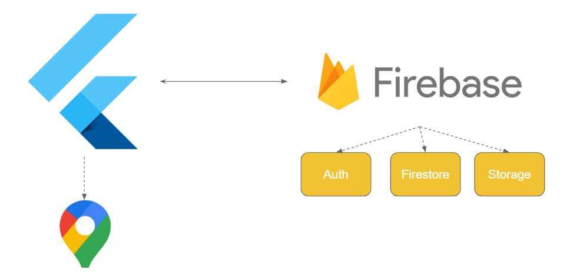

# iRecycler Mobile

El proyecto que se presenta consiste en una aplicación móvil que busca visualizar distintos puntos de reciclaje a lo largo de la ciudad de Temuco. Además de permitir añadir nuevos, actualizar o eliminar los que ya se tienen registrados junto con poder monitorear su capacidad de almacenaje. 

## Arquitectura

## Funcionalidades

- Inicio de sesión con email y contraseña
- Registrar usuario
- Agregar nuevo punto
- Visualizar puntos en mapa y filtrar mis puntos
- Visualizar en una lista mis puntos para monitorear la capacidad

## Demostración

